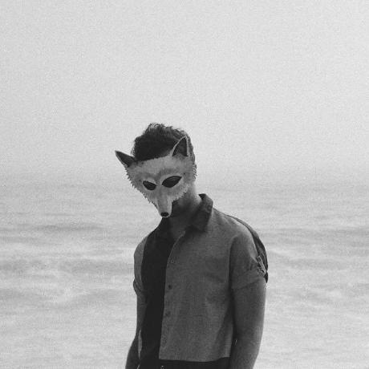

---
layout: home
---   
<h2>

  Ao Wang
</h2>
I am a Ph.D. student from [Computer Science Department](https://cs.gmu.edu/) at [George Mason University](https://www2.gmu.edu/), 
where I work with [Dr. Yue Cheng](https://cs.gmu.edu/~yuecheng/) in [LeapLab](https://mason-leap-lab.github.io/).

I earned M.S. degree from the [Computer Science Department](https://www.cs.seas.gwu.edu/) of The [George Washington University](https://www.gwu.edu/).

My research focuses on Serverless computing, Cloud Computing and Cloud Storage.

### Publications
- [InfiniCache: Exploiting Ephemeral Serverless Functions to Build a Cost-Effective Memory Cache](https://www.usenix.org/conference/fast20/presentation/wang-ao)
  - **Ao Wang**, Jingyuan Zhang, Xiaolong Ma, Ali Anwar, Lukas Rupprecht, Dimitrios Skourtis, Vasily Tarasov, Feng Yan, Yue Cheng
  - [USENIX FAST 2020](https://www.usenix.org/conference/fast20)
- [In Search of a Fast and Efficient Serverless DAG Engine](https://arxiv.org/abs/1910.05896)
  - Benjamin Carver, Jingyuan Zhang, **Ao Wang**, Yue Cheng
  - PDSW 2019

* [HyperFaaS: A Truly Elastic Serverless Computing Framework](https://cs.gmu.edu/~yuecheng/docs/nsdi19_hyperfaas.pdf)
  * Jingyuan Zhang, **Ao Wang**, Min Li, Yuan Chen, Yue Cheng
  * [USENIX NSDI 2019](https://www.usenix.org/conference/nsdi19) (poster)

### Working Experience
* 05/2019 - present, Teaching Assistant, George Mason University
* 05/2019 - 08/2019, Research Assistant, George Mason University
* 08/2018 - 05/2019, Teaching Assistant, George Mason University

### Professional Activities

- EuroSys 2020 shadow PC

### Selected Award

- Student Travel Grant, USENIX FAST 2020
- Student Travel Grant, USENIX NSDI 2019